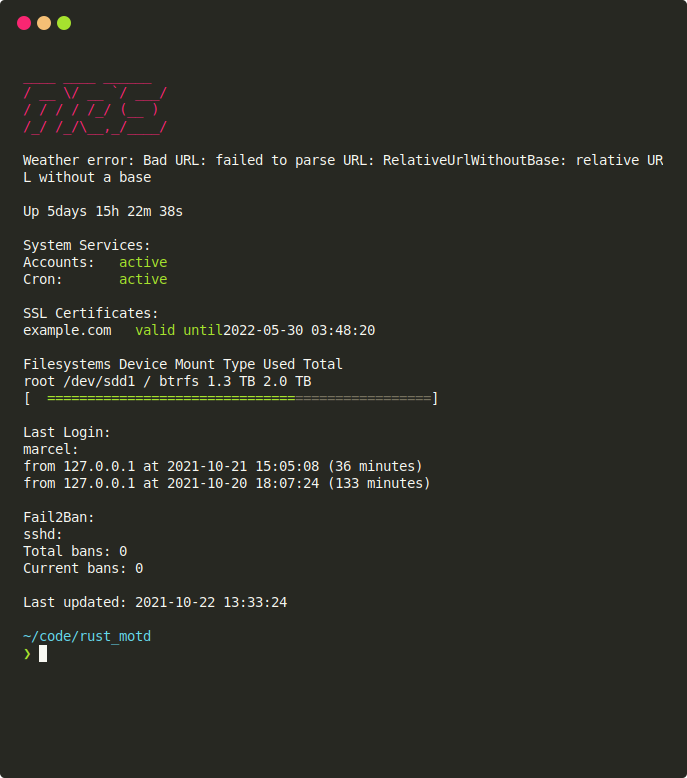

# `rust-motd`

> Beautiful, useful, configurable MOTD generation with zero[¹](#footnote-1) runtime dependencies

<p align="center">
	
</p>

I got stuck in dependency hell one too many times
trying to update interpreted alternatives
and decided to write my own MOTD generator in Rust.
The goal of this project is to provide beautiful yet useful status screens
which can quickly give an overview of your server or personal computer.

## Installation

### Building from source

- Install [rustup](https://rustup.rs/) and [cargo](https://github.com/rust-lang/cargo/)
- Install and configure the default toolchain with `rustup install stable` and `rustup default stable`
- Install the equivalent of the `libssl-dev` package using your package manager
- Clone this repository and enter it
- Run `cargo build` or `cargo run`

<a id="compiling-alpine"></a>
Note: To cross compile, you may need to install additional packages. For example, to cross compile for Alpine, it was necessary to install the `musl-tools` package on Ubuntu (specifically to compile the `ring` crate), after which an executable could be successfully cross-compiled with `cargo build --target x86_64-unknown-linux-musl` (assuming you've already added the `musl` toolchain via `rustup target add x86_64-unknown-linux-musl`).
[See more.](https://www.reddit.com/r/rust/comments/qdm8gf/comment/hhor67v/?utm_source=share&utm_medium=web2x&context=3)

### Arch Linux

`rust-motd` is in the AUR under [`rust-motd-bin`](https://aur.archlinux.org/packages/rust-motd-bin/) thanks to [`cargo-aur`](https://github.com/fosskers/cargo-aur).

## Configuration

`rust-motd` uses a `TOML` configuration file to determine which components to run, and any parameters for those components. Components can be enabled or disabled by including or removing/commenting-out the relevant section of configuration. The enabled components will be printed in the order they appear in the configuration file. In other words, you can customize the printing order by rearranging the sections of the configuration file. An example configuration file is included in [example_config.toml](example_config.toml).

A configuration file can either be specified as the first argument to `rust-motd` via the command line or placed in one of two default locations. If a config file is not specified as an argument, `rust-motd` will check `$XDG_CONFIG_HOME/rust-motd/config.toml` and `$HOME/.config/rust-motd/config.toml` in that order.

The options for each component are listed below:
### Banner

- `color`: The color of the banner text. Options are black, red, green, yellow, blue, magenta, cyan, white, and light variants of each.
- `command`: A command executed via `sh` which generates the banner. For example, you could pipe the output of `hostname` to `figlet` to generate a block letter banner.

### Weather

The weather component allows you to either specify a [wttr.in](https://wttr.in) URL, or a location and display style which will be used to build the URL.

Either:

- `url`: a [wttr.in](https://wttr.in) query URL for the relevant location. E.g. `https://wttr.in` or `https://wttr.in/New+York,New+York?0`. For more detail about the options available via the request URL, see the [wttr.in documentation](https://github.com/chubin/wttr.in). The response of an http request to the specified URL is output directly to the console, so in theory you could use a service other than [wttr.in](wttr.in).

or:

- `loc`: The location to retrieve the weather for, e.g. "New York,New York".
- `style`: One of either "oneline", "day", or "full".

In the case both are specified, the `url` parameter is given priority.

If you need a proxy to access the internet, specify it in below item:

- `proxy`: The http proxy server which used to access internet.

### Service Status

- List of `systemd` services to display the status of. Keys are used as the service display name, while the value is the name of the service itself.

### Docker Status

- List of containers to show the status of.
Keys are used as the internal docker names
(`NAMES` column of `docker ps`)
(containers can have multiple names, and the container is selected if any of the names match).
Values are the display name shown in the output.
The key **must** start with a `/` for internal containers (please see [here](https://github.com/moby/moby/issues/6705)).

### Uptime

- `prefix`: Text to print before the formatted uptime.

### SSL Certificates

- `sort_method`: The order to sort the displayed SSL certificates. Options are "alphabetical", "expiration", or "manual", in which case the certs will be displayed in the same order that they appear in the config file.
- `[ssl_certificates.certs]`: A subsection which is a list pairs of of certificate display names (keys) and certificate paths (values).

### Filesystems

 - List of filesystems to print the information of, in the form of pairs of names (used for display) and mount points.

 ### Memory

 - `swap_pos`: Either `beside`, `below` or `none` to indicate the location to display the swap memory usage, if any.

### Fail2Ban

- `jails`: A list of Fail2Ban jails to print the ban amounts of.

### Last Login

- List of users (keys) and number n (values) of that user's n most recent logins to display.

### Last Run

- If present, prints the time that the `rust-motd` was run (useful if updating the motd only periodically e.g. via Cron).

### Global Config
The global configuration is used for settings that may span multiple components, e.g. the time format string, and progress bar style.

- `progress_full_character` (Default `'='`): The character to use for the line segment of the progress bar indicating the "active" portion of the quantity represented
- `progress_empty_character` (Default `'='`): The character to use for the line segment of the progress bar indicating the "inactive" portion of the quantity represented
- `progress_prefix` (Default `"["`): The character to used to cap the left side of the progress bar
- `progress_suffix` (Default `"]"`): The character to used to cap the right side of the progress bar
- `progress_width` (Default `80`): The default width of the progress bar, used only if no other "size hint" is available. More specifically, the `filesystem` component will automatically determine its width. If the `filesystem` component is present, then the `memory` component will use the width of the filesystem as its size hint. Otherwise it will use the configured value.
- `time_format` (Default `"[year]-[month]-[day] [hour]:[minute]:[second]"`): time format string

## Setup

### Displaying MOTD on login (server setup)

The canonical MOTD is a message printed on login.
To achieve this, the file `/etc/motd` must be kept up to date with the output of `rust-motd`.
One of the simplest ways to do this is with a cron job.
The line below will update `/etc/motd` every 5 minutes.
This must be run as root (`sudo crontab -e`)
in order to write to the protected file `/etc/motd`.

```cron
*/5 * * * * rust-motd > /etc/motd
```

### Displaying MOTD on every new terminal (personal computer setup)

It can also be nice to show the MOTD locally every time you launch a new terminal emulator
(or on every new pane if you use `tmux`).
Indeed, some components make more sense on a server (`ssl`, `fail2ban`, `last_login`)
whereas others make more sense on a local machine (weather, user services).

The setup for this is slightly different.
First of all, you will probably want to run `rust-motd` as your normal user,
not as root.
This is especially true if you are using the user services component.
This also means that you won't have permission to write to `/etc/motd`.
I chose `~/.local/etc/motd`.
Finally, I had to set the environment variable `DBUS_SESSION_BUS_ADDRESS`
in my `crontab` in order to see the status of my user `systemd` services.
Without it, the underlying call to `systemctl` would return nothing
and nothing would be shown in `rust-motd`.

```cron
*/5 * * * *  export DBUS_SESSION_BUS_ADDRESS=unix:path=/run/user/1000/bus; rust-motd > ~/.local/etc/motd
```

Finally, with `~/.local/etc/motd` populated,
the last step is to print the contents of this file every time a new terminal emulator is launched.
Open your shell's configuration file (`.bashrc`, `.zshrc`, etc.)
and add the following line at the very bottom
(if you aliased `cat` to `bat` as I did replace `cat` below with `command cat`):

```
cat $HOME/.local/etc/motd
```


## Alternatives

`rust-motd` took a lot of inspiration from `panda-motd`.

- [panda-motd](https://github.com/taylorthurlow/panda-motd): "a utility for generating a more useful MOTD", Ruby
- [motd-on-acid](https://github.com/x70b1/motd-on-acid):  "This MOTD has so many colors!", Shell
- [fancy-motd](https://github.com/bcyran/fancy-motd): "Fancy, colorful MOTD written in bash. Server status at a glance.", Shell
- [HermannBjorgvin/MOTD](https://github.com/HermannBjorgvin/motd): "Mini MOTD, a customizable, configurable, standardized MOTD for your homelab server or laptop", Shell

Search "MOTD" on [r/unixporn](https://reddit.com/r/unixporn) for more!

## Acknowledgements

A huge thank you to the kind folks at Jupiter Broadcasting
for featuring `rust-motd` on [Linux Unplugged 428](https://linuxunplugged.com/428)!

`rust-motd` is made possible by the following packages:

- [wttr.in](https://github.com/chubin/wttr.in) ":partly_sunny: The right way to check the weather"
- [systemstat](https://github.com/unrelentingtech/systemstat): "Rust library for getting system information", used for filesystem usage
- [termion](https://docs.rs/termion/1.5.6/termion/): Rust library used to print fancy colours in the terminal
- [termtosvg](https://github.com/nbedos/termtosvg): "Record terminal sessions as SVG animations", used to generate the preview in the README
- [bytesize](https://docs.rs/bytesize/1.0.1/bytesize/): Rust library used for binary size representations
- [humantime](https://docs.rs/humantime/2.0.1/humantime/): "Human-friendly time parser and formatter", used for uptime component

## Footnotes
<a id="footnote-1"></a>
¹: Certain components do have dependencies: `fail2ban` (`fail2ban`), `service_status` (`systemd`),
`last_login` (`last`).
However, it would not make sense to request the status of a package that is not installed.
[Furthermore, there are some caveats when compiling for minimal distributions like Alpine Linux.](#compiling-alpine)
